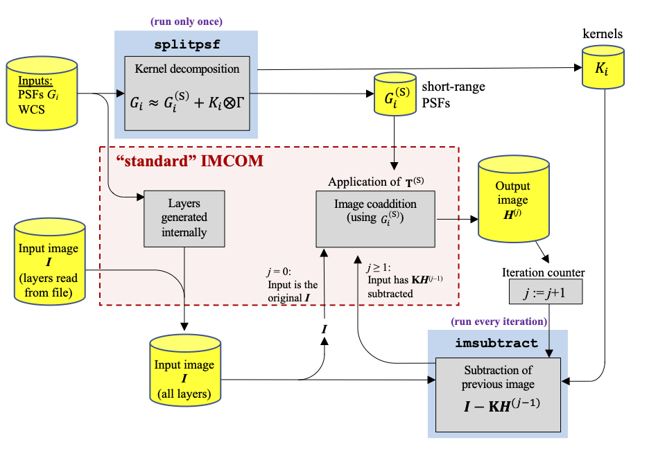

PSF splitting
#############

PSF splitting is an iterative algorithm for handling features in the PSF that extend beyond the postage stamp boundary. The key idea is that the PSF is split into a short and long-range part::

  G_i = Gs_i + K_i (*) Gamma + zeta_i

where ``G_i`` is the PSF in image ``i``; ``Gs_i`` is the short-range PSF; ``Gamma`` is the target output PSF; ``K_i`` is a long-range kernel; and ``zeta_i`` is a residual (which needs to be small for PSF splitting to work). Here ``(*)`` denotes a convolution. Since ``Gs_i`` can be made compact, we can eliminate truncation errors when "standard" PyIMCOM is run. The output image is then convolved with ``K_i``, the result is subtracted from the original input images, and then the PyIMCOM kernel is re-run. The correction is formally iterative, although we hope not too many iterations will be required.

The current implementation only works for output Gaussian PSF (an error will be returned if PSF splitting is run and ``cfg_dict['OUTPSF'] != 'GAUSSIAN'``).

Quick start: running the workflow
=================================

An example workflow script, using perl + slurm, is in `writejob_example.pl <../scripts/writejob_example.pl>`_. This carries out the sequence of steps:

0. PSF splitting (separates the PSF into short- and long-range pieces)

1. Build input layers

2. First run of PyIMCOM (iteration 0, with smaller ``INPAD`` radius, so that it is faster)

3. Imsubtract run

4. Update the cached input layers (and stash the old ones)

5. Final run of PyIMCOM (iteration 1)

6. `Compression <compress_README.rst>`_

7. `Write report <diagnostics_README.rst>`_

The perl script can be run on the Ohio Supercomputer Center using the format::

  perl writejobs_example.pl $ACCOUNT $CONFIGURATION $LOGFILETAG $SCRIPTTAG
  # $ACCOUNT       = the account name you want to use
  # $CONFIGURATION = the configuration file you want to run
  # $LOGFILETAG    = prefix for the log files
  # $SCRIPTTAG     = prefix for the scripts to write

**Important**: On other platforms, you may need to adjust the handling of OSC's ``$TMPDIR`` variable (which is where on-node storage is located; this may differ across various HPC platforms).

When the script is run, it will prompt you for a Y/N answer on whether you want to proceed with job submission. A ``Y`` answer will submit the jobs via slurm, using ``afterok`` to pipeline the job arrays. A ``N`` will exit without submitting the jobs (but you can still inspect them).

Note that this script doesn't clear the cache files; if you are re-starting after a failure, or re-running the workflow, you will have to do that manually (it is too dangerous for me to want to automate!).

Details
#######

Setup
=====

If PSF splitting is used, then *before* the main PyIMCOM run, one must run PSF splitting, e.g.::

  python3 -m pyimcom.splitpsf.splitpsf config.json

(where you should replace ``config.json`` with the actual location of the configuration file). This uses the same storage location as the cache for the images, e.g., if ``INLAYERCACHE`` is ``/scr/myImcomProject/store-F`` then a directory with PSF-split data will be created with the name ``/scr/myImcomProject/store-F.psf``, and PSF-split FITS files will be created of the form ``f'psf_{obsid}.fits'``.

Configuration options for PSF splitting
---------------------------------------

The configuration file can contain an entry that activates PSF splitting, e.g.::

  "PSFSPLIT": [6, 10, 0.01]

Here the first 2 entries are the range of pixels (in this case: the "short range" PSF cuts of 6-10 native pixels from the center); and the last entry (here: 0.01) is the regularization parameter (epsilon) that prevents division by zero in constructing K_i. Smaller values will produce a more accurate PSF (smaller zeta_i) but be noisier (contain more positive and negative lobes).

PSF split format file
---------------------

The PSF-split files are multi-extension FITS files, with a primary HDU and 3x18=54 extensions. The primary HDU contains several important keywords:

* ``PORDER`` and ``NCOEF`` are the Legendre polynomial order and the number of coefficients ``NCOEF=(PORDER+1)**2``, respectively.

* ``FROMFILE`` and ``INWCS##`` keyword contains the location of the input PSFs and WCSs.

* ``MAXZETA`` is the worst-case residual (largest value of ``zeta_i``) in that PSF.

* ``OBSID``, ``NSCA``, and ``OVSAMP`` indicate the observation ID, number of SCAs (18 for Roman), and PSF oversampling ratio.

* ``GSSKIP`` and ``KERSKIP`` indicate how to find the right extension for a particular application: the PSF for SCA ``i`` is in HDU ``i``; the short-range PSF is in HDU ``GSSKIP+i``; and the kernel K_i is in HDU ``KERSKIP+i``. (So for example, if ``GSSKIP`` = 18 and ``KERSKIP`` = 36, then the PSF is in HDU #5, the short-range PSF is in HDU #23, and the kernel is in HDU #41.)

Each of these HDUs are a 3D array (Legendre cube), with the number of slices corresponding to the number of coefficients.

The iteration step
==================

The iteration step can be run as a module::

  python3 -m pyimcom.splitpsf.imsubtract config.json 14

to run all images from SCA 14. You will need to run this 18 times (once for each SCA) to make sure all the images have been observed.

The ``pyimcom.splitpsf.imsubtract.run_imsubtract`` function controls all the mechanics of running the code. Its format is::

  run_imsubtract(config_file, display=None, scanum=None, local_output=False, max_img=None)

where the ``config_file`` is passed as a string, and if ``scanum`` is provided (integer in the range 1..18) then ``run_imsubtract`` only runs that SCA. Note that ``run_imsubtract`` contains its own "outer loop" over input exposures.

The WCS routines are pulled into ``get_wcs`` (which reads a cached file), which seamlessly handles either FITS or ASDF.

The "subtracted" images are written to ``f"{cfgdata.inlayercache}_{obsid:08d}_{sca:02d}_subI.fits"``.

Re-insertion into PyIMCOM
=========================

The subtracted images are re-inserted as the cached files by the command::

  python3 -m pyimcom.splitpsf.update_cube config.json

This first checks that all files are available, and then moves the subtracted files into the cache location ``f"{cfgdata.inlayercache}_{obsid:08d}_{sca:02d}.fits"``. The previously cached files are archived in ``f"{cfgdata.inlayercache}_{id:08d}_{sca:02d}_{iter:02d}iter.fits"``.

This also updates the iteration number (``iter``), which is assumed to start at 0. The iteration number is stored in the file ``f"{cfgdata.inlayercache}_iter.txt"``.

Finally, it is possible that different runs will have different configuration settings, so the previous configuration file(s) are stored in ``f"{cfgdata.inlayercache}_oldcfg.json"``.
